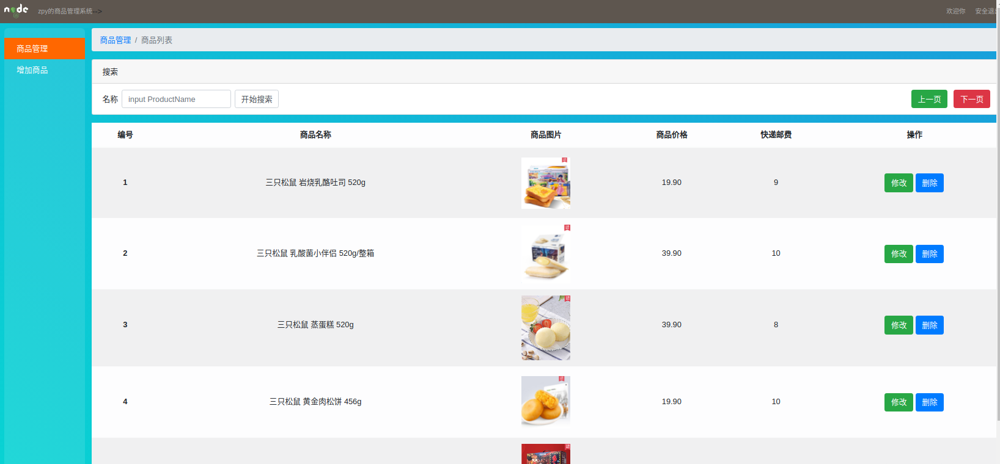

## 1）项目设计部分：

#### （1）项目总体构成；

​		该项目是运用本学期学到的nodejs+mongodb+express+ejs，参考https://github.com/shataniya/Commodity-management-system所完成的商品管理系统。用户可以通过登录本平台的商品列表界面对商品进行一系列的浏览与搜索，管理员可以通过登录本平台的商品管理界面对商品进行增删查改等操作。该商品管理系统可以完成用户的注册与登陆，包含商品列表、商品管理、商品增加等界面，为商品管理应用提供了一定的帮助。

#### （2）引入的包在项目中的作用相关说明；

  要开始使用本平台，请先引入相关包，利用命令将相应文件包安装到路径中: 

  npm install express

express是基于 [Node.js](https://nodejs.org/en/) 平台，快速、开放、极简的 Web 开发框架。

  npm install ejs

ejs是高效的嵌入式 JavaScript 模板引擎。

  npm install fs

fs模块支持以标准 POSIX 函数建模的方式与文件系统进行交互。

  npm install md5-node

MD5（Message-Digest Algorithm）是计算机安全领域广泛使用的散列函数（又称哈希算法、摘要算法），主要用来确保消息的完整和一致性。常见的应用场景有密码保护、下载文件校验等。

  npm install multiparty

 Multiparty是用来解析FormData数据的一款插件。

  npm install body-parser

body-parser是一个HTTP请求体解析的中间件，使用这个模块可以解析JSON、Raw、文本、URL-encoded格式的请求体。

  npm install mongodb

MongoDB 是一个介于关系数据库和非关系数据库之间的产品，是非关系数据库当中功能最丰富，最像关系数据库的。

  npm install mongoose

Mongoose为模型提供了一种直接的，基于scheme结构去定义你的数据模型。它内置数据验证， 查询构建，业务逻辑钩子等，开箱即用。

  npm install express-session

session 是另一种记录客户状态的机制，不同的是 Cookie 保存在客户端浏览器中，而 session 保存在服务器上。

#### （3）项目目录结构和各个部分的说明。

该项目包含node_modules,public,router,upload,views等文件夹与app.bac.js,app.js,database.js,mongodb.js等文件

其中，

node_modules文件夹是上文引入相关包所创建的文件夹，可以直接复制到项目文件夹中就无需使用以上命令另外安装。

public文件夹中包含bootstrap-4.3.1-dist包与css,js文件夹，都是对项目界面进行一系列的美化。

router文件夹是将一些app.get()和app.post()等都抽取出来的一个路由模块，其只用来处理路由，根据不同的请求方法和请求路径设置具体的请求处理函数，增强了项目代码的可维护性，提升开发效率。其中包括了admin.js(设置区分管理员与用户的方法)，user.js(定义用户数据库表存储结构)，admin文件夹中包含login.js(封装用户注册、用户登陆、用户登出功能函数)，product.js与productdo.js(封装商品查询、商品增加、商品删除、商品查询、商品修改功能函数)，product与productdo文件夹(包含next,previous和search分别封装跳转下一页，跳转上一页与自定义查询功能函数)。

upload文件夹中包含了上传商品的所需要的图片文件。

views文件夹是项目界面文件夹。其中包括login.html(用户登陆界面),main.html(初始界面),product.html(商品列表界面),productadd.html(商品增加界面),productdo.html(商品管理界面),productedit.html(商品编辑界面),register.html(用户注册界面)与public文件夹(其中包括header.html(首部导航界面),prolist1.html(productdo,productadd,productedit的左侧导航界面),prolist2.html(product的左侧导航界面))。

app.bac.js配置相关session并且使用app.use(),app.set(),app.engine(),app.get()等封装一些相关函数。

app.js配置 body-parser 中间件，并实现用户注册，用户登陆，用户登出，商品列表罗列，商品操作，商品删除，商品填加，商品获取，商品编辑，商品更新等功能。

database.js实现与数据库的连接并连接‘user’集合。

mongodb.js实现与数据库的连接并封装数据查询，数据插入，数据修改，数据删除等功能函数。

## 2）使用说明书：

#### 首页：

默认进入首页，在首页中可以根据“登陆”与“注册”按钮进入相应的界面。

#### 注册功能：

可以注册用户名与密码并录入数据库user中（默认注册的都是普通用户）。点击“Register”后跳转到登陆界面。

#### 登陆功能：

登陆已注册的用户名与密码。

#### 区分管理员与用户功能：

根据从登陆界面获取到的信息，系统会自动判断是否为管理员（管理员有且只有一个，是优先录入好的账号，用户名为admin，密码为123）。若登陆的为管理员则进入商品管理界面，若登陆的为普通用户则进入商品列表界面。这边先登陆管理员账号进入商品管理界面。

### 以下功能如有延迟请点击“开始搜索“按钮进行刷新。

#### 增加商品功能：

点击左侧导航栏的“增加商品”按钮。进入增加商品界面。

输入相应的商品信息后，点击“提交”按钮。

弹窗“商品添加成功～～”，点击“OK”后会进入商品管理界面。

可以看到在商品管理界面的第五栏中出现了新增加的商品信息。

#### 修改商品信息功能：

点击商品右侧的“修改”按钮，进入编辑商品界面。

这里修改商品价格为“10”，点击“提交”按钮后会弹窗“商品数据修改成功”，点击“OK”后会进入商品管理界面。

可以看到”手撕面包“的商品价格已经被改为“10”了。

#### 删除商品功能：

点击商品右侧的“删除”按钮，进行删除操作。

弹窗“成功删除商品～～”，点击“OK”后会进入商品管理界面。

可以看到“手撕面包”已经被删除了。

#### 翻页功能：

可以通过点击“上一页”“下一页”这两个按钮进行翻页。

点击“上一页”后跳转。

#### 查询功能：

可以在导航栏进行搜索。但注意在商品列表的第一页才可以搜索全部商品（能力有限，感觉怎么优化都改不掉）

#### 

#### 使用普通用户账号进入商品列表界面，商品列表界面同样能实现翻页与查询功能。

## 3）开发日记（与commit对应）

2021/12/18：今天在一筹莫展中找到了https://github.com/shataniya/Commodity-management-system分享的系统，很开心。引入了相关包后，能够运行。进行了相关修改，能够连上自己的数据库了，登录注册(login,register success)都能完成。进行了相关优化后，能实现增删查改(add,edit,delete,search success)等功能。在这之后，我在products集合里导入了我自己的商品数据。令人头疼的是，关于翻页的功能(next,previous)一直无法实现。

2021/12/19：今天我优化了翻页的功能(next,previous success)使之能够正常的上下页跳动。但仍无法使“无数据就无法进入下一页“这一功能实现。可能超出了知识范畴，我就先跳过进行接下来的操作。将项目进行更改优化后，我发现查询功能只能在”/product“或者在”商品列表的第一页“使用，进行了相关查询与优化。仍然无法解决，很沮丧，可能也超出了知识范畴。决定先跳过，进行管理员与用户的区分操作。我添加了一个"isAdmin"数据库数据，用户在注册的时候默认是false。也能够传到数据库里。但，在区分的时候”isAdmin“传不过来。目前一些细碎的功能优化完成(youhua success)，仍需优化。

2021/12/20：今天很高兴，在老师同学的帮助下完成了区分管理员与普通用户这一功能(admin,user success)。改动相当庞大，又制作了一个独属于管理员的界面和一个独属于普通用户的界面。对router和app.js的功能函数进行了相关改动，终于能够顺利运行了。在接下来的测试中也不断改动优化其界面，这个项目总的来说算是完成了。接下来，我开始按照标准完成README.md文件(README.md half)，目前已完成了大半。

2021/12/23 ：今天完善了README.md文件，并部署了服务器(final success)。后来发现主程序填写错误，在老师的帮助下，终于运行成功！感谢老师！（success!）

